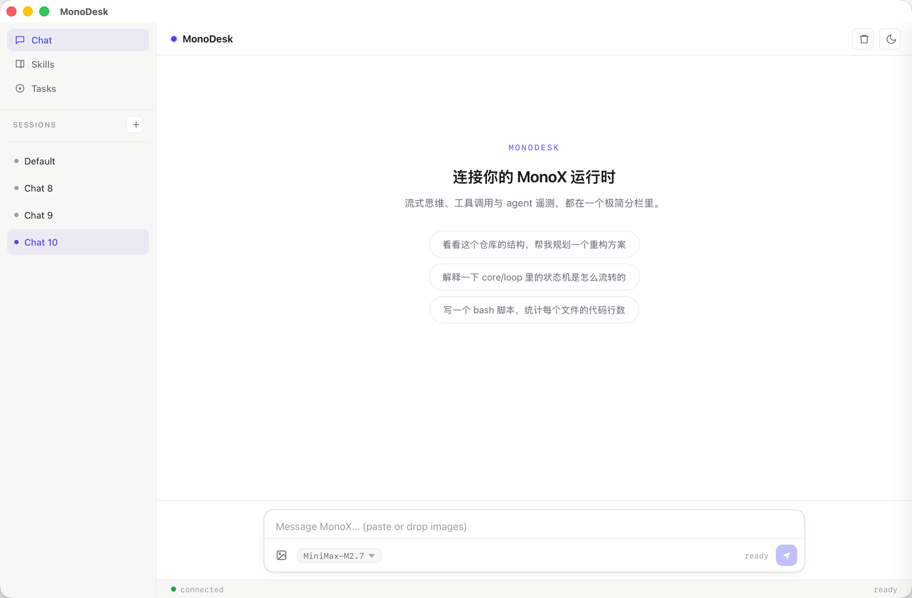
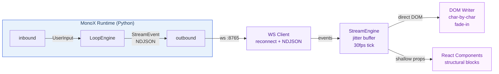

<p align="center">
  
</p>

<p align="center">
  <strong>English</strong> · <a href="README_zh.md">中文</a>
</p>

<p align="center">
  
</p>

# MonoDesk

**The desktop channel for [MonoX](https://github.com/halcyonway/MonoX).**

MonoDesk streams token output from MonoX Runtime to your screen with a jitter-buffered typewriter effect, and sends your input back. It implements only "view" and "speak" — all agent logic (ReAct loop, tools, memory) lives in MonoX core.

**Stack:** Tauri v2 (Rust window shell) + TypeScript + React 18.

<p align="center">
  [](LICENSE)
  [](https://tauri.app/)
</p>

## Features

- **Jitter buffer typewriter** — Token buffer + 30fps tick at ~90 chars/sec. Each character fades in individually, eliminating jitter.
- **Markdown rendering** — Tables, code blocks, inline code — streamed in real time.
- **Multi-session** — Sidebar session list with independent histories. Switch instantly.
- **Async task tracking** — Built-in Tasks page for long-running async operations.
- **Lightweight Tauri shell** — Rust does only window management; all logic lives in TypeScript.

## Architecture



## Prerequisites

[MonoX Runtime](https://github.com/halcyonway/MonoX) must be running first:

```bash
cd ../MonoX
uv run python run.py        # starts ws server on :8765
```

## Getting Started

**Browser (development):**
```bash
npm install
npm run dev                 # http://localhost:5173
```

**Desktop app:**
```bash
npm run tauri dev           # dev + window
npm run tauri build         # production .app/.msi
```

**Override WS URL (connect to a remote runtime):**
```bash
VITE_WS_URL=ws://192.168.1.5:8765 npm run dev
```

## Project Layout

```
src/
├── ws/                     # WebSocket client + reconnect + NDJSON parsing
├── stream/                 # StreamEngine: jitter buffer + typewriter DOM writer
│   ├── engine.ts           #   Core: token/reasoning/tool state machine
│   └── markdown.ts         #   Markdown + table + codeblock renderer
├── components/             # React structural blocks (NOT on token path)
│   ├── Chrome.tsx          #   TopBar + SessionList
│   ├── Conversation.tsx    #   TextStream + ReasonBlock + ToolBlock
│   └── Composer.tsx        #   Input box + IME + status footer
├── store/                  # Local persistence (session list + histories)
│   └── sessions.ts         #   localStorage: monodesk:sessions + histories
├── App.tsx                 # Root: WS lifecycle, session routing, pages
└── styles.css              # Single CSS file with variables + themes
src-tauri/                  # Tauri desktop shell (window + native)
spec/                       # Design documents
```

## Pages

- **Chat** — Conversational interface with token streaming
- **Skills** — Browse available skills from the runtime
- **Tasks** — Async task list and detail views

## Protocol Compatibility

MonoDesk does **not** pin MonoX version. The protocol (envelope + event fields) is the stable contract. Unknown `type` values are silently ignored.

## License

MIT
