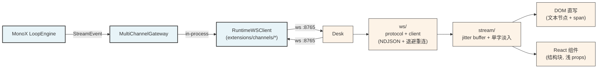

# MonoDesk

[MonoX](https://github.com/halcyonway/MonoX) 的桌面 channel 实现。MonoX Runtime 通过 ws 协议把 `StreamEvent` 流式推给桌面，桌面把用户输入反哺回 Runtime loop。

**MonoDesk 只做「看」和「说」——不实现任何 agent 逻辑。** ReAct 循环、工具执行、checkpoint、memory 全部在 MonoX `core/`。

## 设计哲学

- **MonoDesk 是协议实现，不是产品** —— MonoX 定义 `Channel` Protocol（`start/stop/listen/send`），MonoDesk 实现它 + 加 ws 传输层
- **流式优先** —— token 缓冲 + 30fps tick 合并写 DOM，每帧最多一次重绘；React 只管结构块（turn / reasoning 开关 / tool 起止）
- **Tauri 壳轻量** —— Rust 只做窗口，逻辑全在 TypeScript
- **与 MonoX 解耦** —— MonoDesk 只依赖 MonoX 协议字段（`events.py` 的 dataclass），不依赖具体实现
- **Jitter Buffer 平稳打字机** —— 单字 90cps + 120ms 缓冲，单字从左到右半透明淡入，避免抖动/卡顿

完整设计：`spec/OVERVIEW.md`。

## 架构



> 注：v0.1+ 起 MonoDesk 与 MonoX 之间**统一走 ws :8765**（RuntimeServer 端口）。
> 早期文档里的 `:8766` 是 monodesk channel 独立进程的端口，已废弃。

## 快速启动

**先起 MonoX Runtime**（[github.com/halcyonway/MonoX](https://github.com/halcyonway/MonoX)）：
```bash
cd ../MonoX
uv run python run.py        # 启 ws server :8765
```

**再起 MonoDesk**（Vite 开发模式，纯前端）：
```bash
npm install
npm run dev                  # 浏览器跑 http://localhost:5173，连 ws://127.0.0.1:8765
```

**Tauri 桌面壳**（生产形态）：
```bash
npm run tauri dev            # 同上 + 窗口
npm run tauri build          # 出 .app / .msi
```

覆盖连接地址：
```bash
VITE_WS_URL=ws://192.168.1.5:8765 npm run dev
```

## 目录

```
src/
├── ws/                  # ws 协议 + 客户端（重连 + 帧解析）
├── stream/              # 流式渲染引擎：jitter buffer + 单字淡入（核心资产）
│   ├── engine.ts          #   StreamEngine：token / reasoning / tool 状态机
│   └── markdown.ts        #   markdown + table + codeblock 渲染
├── components/          # React 组件（结构块，不参与 token 路径）
│   ├── Chrome.tsx         #   TopBar + SessionList
│   ├── Conversation.tsx   #   TextStream / ReasonBlock / ToolBlock / MsgView
│   └── Composer.tsx       #   输入框 + IME 处理 + status footer
├── store/               # 本地持久化：会话列表 + 每会话历史
│   └── sessions.ts        #   localStorage: monodesk:sessions + monodesk:histories
├── App.tsx              # 装配 + WS 生命周期
├── main.tsx
└── styles.css           # 单文件 CSS（CSS variables + 主题）
src-tauri/               # Tauri 桌面壳（窗口 + 原生能力）
spec/                    # 设计文档
preview/                 # v0 时期的纯 HTML mockup（保留参考，已不再是权威）
```

## 测试

```bash
npm run build            # tsc --noEmit + vite build（无独立测试套件，渲染层靠 spec snapshot）
```

## 与 MonoX 的版本对齐

MonoDesk 不锁 MonoX 版本号：协议（envelope + event fields）是稳定契约，event 字段加新字段向后兼容，
MonoDesk 未识别的 `type` 直接忽略（`ws/client.ts` 的 try/catch）。