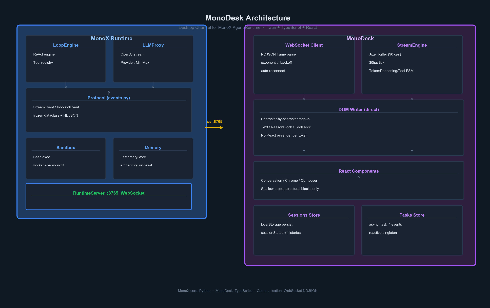

<!-- English -->
# MonoDesk

**The desktop channel for [MonoX](https://github.com/halcyonway/MonoX).**

MonoDesk streams token output from MonoX Runtime to your screen with a jitter-buffered typewriter effect, and sends your input back. It implements only "view" and "speak" — all agent logic (ReAct loop, tools, memory) lives in MonoX core.

**Stack:** Tauri v2 (Rust window shell) + TypeScript + React 18.

## Features

- **Jitter buffer typewriter** — Token buffer + 30fps tick at ~90 chars/sec. Each character fades in individually, eliminating jitter.
- **Markdown rendering** — Tables, code blocks, inline code — streamed in real time.
- **Multi-session** — Sidebar session list with independent histories. Switch instantly.
- **Async task tracking** — Built-in Tasks page for long-running async operations.
- **Lightweight Tauri shell** — Rust does only window management; all logic lives in TypeScript.

## Architecture



```
┌─────────────────────────────────── MonoX Runtime ─────────────────────────────┐
│                                                                                │
│   LoopEngine ──▶ StreamEvent(NDJSON) ──────────────────────────────────────▶  │
│       ▲                                              │                        │
│       │◀────────────────────────────────────────────── UserInput              │
│                                                                                │
└───────────────────────────────────────────────────────────────────────────────┘
                                     │ ws :8765
                                     ▼
                          ┌──────────────────────┐
                          │    MonoDesk          │
                          │                      │
                          │  ┌────────────────┐  │
                          │  │ WS Client      │  │
                          │  │ (reconnect)    │  │
                          │  └───────┬────────┘  │
                          │          ▼           │
                          │  ┌────────────────┐  │
                          │  │ StreamEngine   │  │
                          │  │ jitter buffer  │  │
                          │  │ 30fps tick     │  │
                          │  └───────┬────────┘  │
                          │          ▼           │
                          │  ┌────────────────┐  │
                          │  │ DOM Writer     │  │ ──▶ Character-by-character
                          │  │ (direct write) │  │     fade-in animation
                          │  └────────────────┘  │
                          └──────────────────────┘
```

## Prerequisites

[MonoX Runtime](https://github.com/halcyonway/MonoX) must be running first:

```bash
cd ../MonoX
uv run python run.py        # starts ws server on :8765
```

## Getting Started

**Browser (development):**
```bash
npm install
npm run dev                 # http://localhost:5173
```

**Desktop app:**
```bash
npm run tauri dev           # dev + window
npm run tauri build         # production .app/.msi
```

**Override WS URL (connect to a remote runtime):**
```bash
VITE_WS_URL=ws://192.168.1.5:8765 npm run dev
```

## Project Layout

```
src/
├── ws/                     # WebSocket client + reconnect + NDJSON parsing
├── stream/                 # StreamEngine: jitter buffer + typewriter DOM writer
│   ├── engine.ts           #   Core: token/reasoning/tool state machine
│   └── markdown.ts         #   Markdown + table + codeblock renderer
├── components/             # React structural blocks (NOT on token path)
│   ├── Chrome.tsx          #   TopBar + SessionList
│   ├── Conversation.tsx    #   TextStream + ReasonBlock + ToolBlock
│   └── Composer.tsx        #   Input box + IME + status footer
├── store/                  # Local persistence (session list + histories)
│   └── sessions.ts         #   localStorage: monodesk:sessions + histories
├── App.tsx                 # Root: WS lifecycle, session routing, pages
└── styles.css              # Single CSS file with variables + themes
src-tauri/                  # Tauri desktop shell (window + native)
spec/                       # Design documents
```

## Pages

- **Chat** — Conversational interface with token streaming
- **Skills** — Browse available skills from the runtime
- **Tasks** — Async task list and detail views

## Protocol Compatibility

MonoDesk does **not** pin MonoX version. The protocol (envelope + event fields) is the stable contract. Unknown `type` values are silently ignored.

## License

MIT

---

<!-- 中文 -->
# MonoDesk

**[MonoX](https://github.com/halcyonway/MonoX) 的桌面 Channel 实现。**

MonoDesk 将 MonoX Runtime 的 token 流实时渲染到屏幕上，配合 jitter-buffered 打字机效果，并将用户输入回传给 Runtime。它只实现"看"和"说"——所有 agent 逻辑（ReAct 循环、工具、记忆）都在 MonoX core 中。

**技术栈：** Tauri v2（Rust 窗口壳）+ TypeScript + React 18。

## 特性

- **Jitter Buffer 打字机** — Token 缓冲 + 30fps 刷新，约 90 字符/秒。每字符独立淡入，消除抖动。
- **Markdown 渲染** — 表格、代码块、行内代码，实时流式渲染。
- **多 Session** — 侧边栏会话列表，独立历史记录，秒级切换。
- **异步任务追踪** — 内置 Tasks 页面，追踪长时间运行的异步操作。
- **轻量 Tauri 壳** — Rust 只做窗口管理，所有逻辑在 TypeScript。

## 架构

```
┌─────────────────────────────────── MonoX Runtime ─────────────────────────────┐
│                                                                                │
│   LoopEngine ──▶ StreamEvent(NDJSON) ──────────────────────────────────────▶  │
│       ▲                                              │                        │
│       │◀────────────────────────────────────────────── UserInput              │
│                                                                                │
└───────────────────────────────────────────────────────────────────────────────┘
                                     │ ws :8765
                                     ▼
                          ┌──────────────────────┐
                          │    MonoDesk          │
                          │                      │
                          │  ┌────────────────┐  │
                          │  │ WS Client      │  │
                          │  │ (reconnect)    │  │
                          │  └───────┬────────┘  │
                          │          ▼           │
                          │  ┌────────────────┐  │
                          │  │ StreamEngine   │  │
                          │  │ jitter buffer  │  │
                          │  │ 30fps tick     │  │
                          │  └───────┬────────┘  │
                          │          ▼           │
                          │  ┌────────────────┐  │
                          │  │ DOM Writer     │  │ ──▶ 逐字符淡入动画
                          │  │ (direct write) │  │
                          │  └────────────────┘  │
                          └──────────────────────┘
```

## 前置条件

需先启动 [MonoX Runtime](https://github.com/halcyonway/MonoX)：

```bash
cd ../MonoX
uv run python run.py        # 启动 ws server :8765
```

## 快速开始

**浏览器（开发）：**
```bash
npm install
npm run dev                 # http://localhost:5173
```

**桌面应用：**
```bash
npm run tauri dev           # 开发 + 窗口
npm run tauri build         # 生产 .app/.msi
```

**覆盖 WS URL（连接远程 Runtime）：**
```bash
VITE_WS_URL=ws://192.168.1.5:8765 npm run dev
```

## 项目结构

```
src/
├── ws/                     # WebSocket 客户端 + 重连 + NDJSON 解析
├── stream/                 # StreamEngine: jitter buffer + 打字机 DOM 写入
│   ├── engine.ts           #   核心：token/reasoning/tool 状态机
│   └── markdown.ts         #   Markdown + 表格 + 代码块渲染
├── components/             # React 结构块（不参与 token 渲染路径）
│   ├── Chrome.tsx          #   顶栏 + 会话列表
│   ├── Conversation.tsx    #   TextStream + ReasonBlock + ToolBlock
│   └── Composer.tsx        #   输入框 + IME + 状态栏
├── store/                  # 本地持久化（会话列表 + 历史）
│   └── sessions.ts         #   localStorage: monodesk:sessions + histories
├── App.tsx                 # 根组件：WS 生命周期、会话路由、页面组装
└── styles.css              # 单文件 CSS（变量 + 主题）
src-tauri/                  # Tauri 桌面壳（窗口 + 原生能力）
spec/                       # 设计文档
```

## 页面

- **Chat** — 对话界面，token 流式输出
- **Skills** — 浏览 Runtime 可用的 Skills
- **Tasks** — 异步任务列表和详情

## 协议兼容性

MonoDesk **不锁定** MonoX 版本号。协议（envelope + event fields）是稳定契约。未知的 `type` 值会被静默忽略。

## License

MIT
