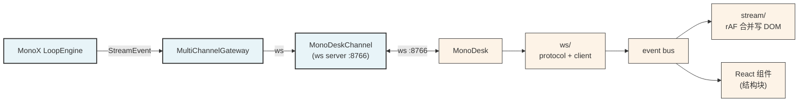

# MonoDesk

[MonoX](https://github.com/halcyonway/MonoX) 的桌面 channel 实现。MonoX Runtime 通过 ws 协议把 `StreamEvent` 流式推给桌面，桌面把用户输入反哺回 Runtime loop。

**MonoDesk 只做「看」和「说」——不实现任何 agent 逻辑。** ReAct 循环、工具执行、checkpoint、memory 全部在 MonoX `core/`。

## 设计哲学

- **MonoDesk 是协议实现，不是产品** —— MonoX 定义 `Channel` Protocol（`start/stop/listen/send`），MonoDesk 实现它 + 加 ws 传输层
- **流式优先** —— token 缓冲 + `requestAnimationFrame` 合并写 DOM，每帧最多一次重绘；React 只管结构块（turn / reasoning 开关 / tool 起止）
- **Tauri 壳轻量** —— Rust 只做窗口，逻辑全在 TypeScript
- **与 MonoX 解耦** —— MonoDesk 只依赖 MonoX 协议字段（`events.py` 的 dataclass），不依赖具体实现

完整设计：`spec/OVERVIEW.md`。

## 架构



## 快速启动

**先起 MonoX Runtime**（[github.com/halcyonway/MonoX](https://github.com/halcyonway/MonoX)）：
```bash
cd ../MonoX
uv run python run.py
```

**再起 MonoDesk**：
```bash
npm install
npm run tauri dev          # 开发窗口（连 ws://127.0.0.1:8766）
```

覆盖连接地址：
```bash
VITE_WS_URL=ws://192.168.1.5:8766 npm run tauri dev
```

## 目录

```
src/
├── ws/                  # ws 协议 + 客户端（重连 + 帧解析）
├── stream/              # rAF 流式渲染引擎（核心资产）
├── components/          # React 组件
└── App.tsx              # 装配
src-tauri/               # Tauri 桌面壳
spec/                    # 设计文档
```

## 测试

```bash
npm run build            # tsc + vite build（无独立测试套件）
```